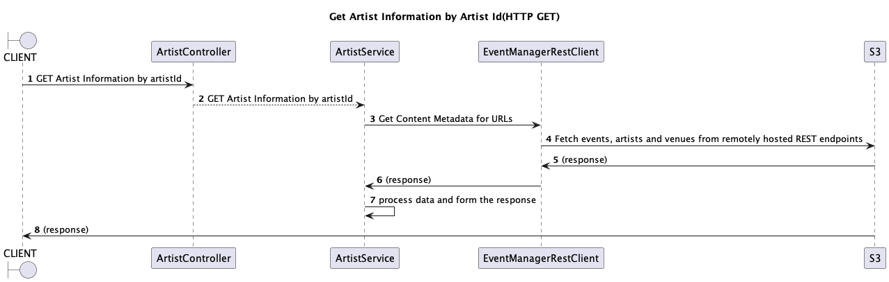

# Event Manager Service

## Get artist information
API to Get artist information for a specific artistId

HTTP GET: /eventManager/v1/artist/{artistId}



Sample Request(using postman):

`
http://localhost:8080/eventManager/v1/artist/22
`

Sample Response:
```
{
    "result": "SUCCESS",
    "artistInfo": {
        "name": "Colosseum",
        "id": "22",
        "imgSrc": "//some-base-url/colosseum.jpg",
        "url": "/colosseum-tickets/artist/22",
        "rank": 2,
        "events": [
            {
                "title": "Blues In Space",
                "id": "2",
                "dateStatus": "singleDate",
                "timeZone": "Europe/London",
                "startDate": "2020-10-18T00:00:00",
                "venue": {
                    "name": "O2 Institute2 Birmingham",
                    "url": "/o2-institute2-birmingham-tickets-birmingham/venue/42",
                    "city": "Birmingham",
                    "id": "42"
                },
                "hiddenFromSearch": false
            },
            {
                "title": "A festival Live",
                "id": "7",
                "dateStatus": "singleDate",
                "venue": {
                    "name": "O2 Academy Brixton",
                    "url": "/o2-academy-brixton/venue/45",
                    "city": "London",
                    "id": "45"
                },
                "hiddenFromSearch": false
            },
            {
                "title": "Harisson Live",
                "id": "11",
                "dateStatus": "singleDate",
                "venue": {
                    "name": "The O2",
                    "url": "/o2/venue/44",
                    "city": "London",
                    "id": "44"
                },
                "hiddenFromSearch": false
            },
            {
                "title": "Huge Live",
                "id": "13",
                "dateStatus": "multiDate",
                "venue": {
                    "name": "O2 Academy Sheffield",
                    "url": "/o2-academy-sheffield-tickets-sheffield/venue/41",
                    "city": "Sheffield",
                    "id": "41"
                },
                "hiddenFromSearch": false
            }
        ]
    }
}
```

If incase of invalid artistId,

Sample Request:

`
http://localhost:8080/eventManager/v1/artist/222
`

Sample Response:
```
{
    "result": "ERROR",
    "messages": [
        "Invalid Artist Id!!"
    ]
}
```

## How to build
`
gradle clean build
`

## How to run the application

1. Clone the project to local 
```
git@github.com:ganesh-shiva/event-manager-service.git
```
2. Build the project using above command
3. After build is successful, please enter below command to start the service in terminal,
```
./gradlew bootRun
```
This command will start the service and once service is up & running, you can invoke endPoint using REST Client like Postman tool as documented above

4. Or you can run the service in IDE tool as well

## Tech Stack used
```
Java 17
Embedded Tomcat container
Gradle build tool
Apache Http Client for REST invocation
SLF4J for logging
Lombok for creating model classes
```

## Trade-off and Design decision
1. Keeping happy flow in mind and as a version 1.0, I have kept the flow direct and simple. For every invocation of Get Artist information, the service at the moment make a REST call to remotely exposed endpoint(S3) each time.

```
HTTP GET: /eventManager/v1/artist/{artistId}
```

2. We can greatly optimize this architecture by introducing in-memory Caching and store the data in the cache after invoking REST call to remotely exposed endpoint(S3) during service start-up.

3. Introducing the caching layer, not only improves the efficiency and throughput of the API but also reduces the avoidable multiple network calls  
4. S3 endpoints are now kept inside te class as constant, instead better to read it from yaml/properties file 
